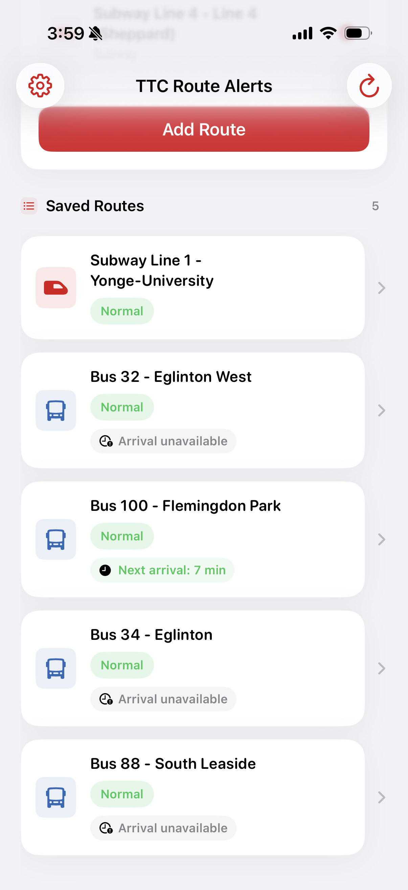
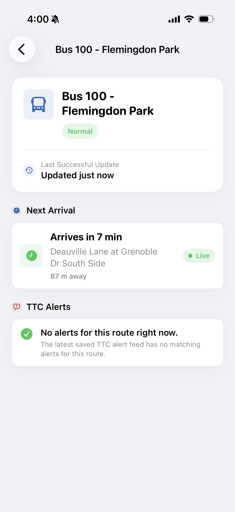
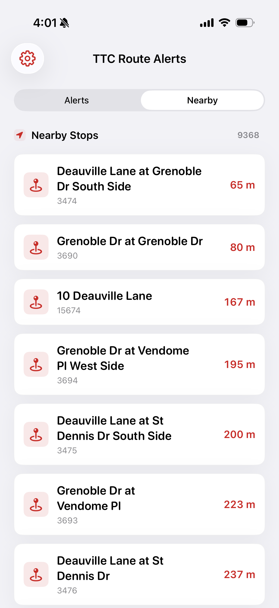
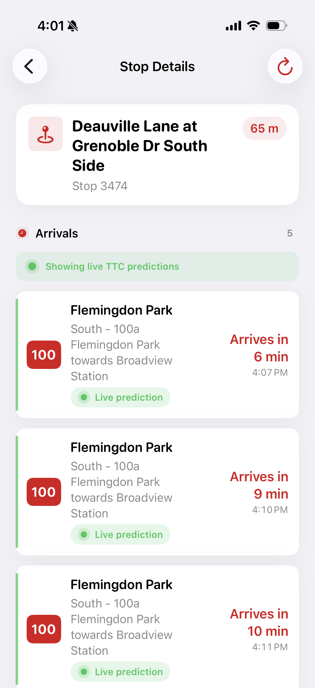
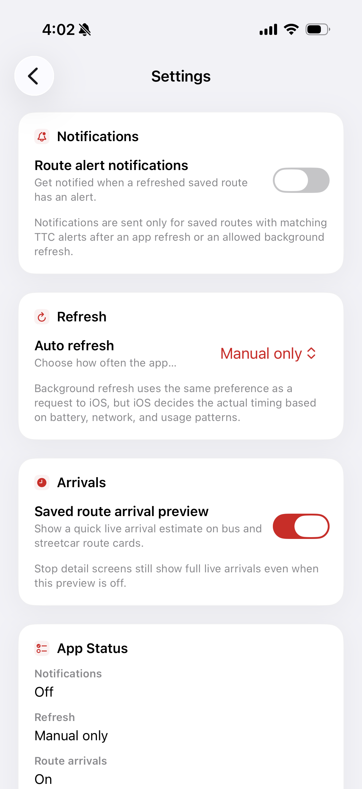

# TTC Route Alerts

TTC Route Alerts is an independent SwiftUI transit utility app for saving regular TTC routes, checking route-specific service alerts, and viewing arrival information for nearby or saved stops. It stores user preferences locally, uses public TTC feeds, and keeps the interface focused on the routes riders actually use.

## Disclaimer

TTC Route Alerts is an independent transit utility app. It is not affiliated with, endorsed by, sponsored by, or operated by the Toronto Transit Commission. TTC route, alert, stop, and arrival information is provided through public transit data services and may not always be accurate or available.

## Features

- Route-specific TTC alerts for saved subway, bus, and streetcar routes
- Saved routes with optional nicknames for quick access
- Live BusTime arrival predictions using TTC BusTime/NVAS data
- Nearby stops based on the user's current location
- Saved route arrival previews on bus and streetcar route cards
- Background refresh support for best-effort alert updates
- Local notifications for saved routes with active alerts

## Screenshots

### Home Screen



### Route Details & Alerts



### Nearby Stops



### Live TTC Predictions



### Settings



## Privacy

- Saved routes are stored locally on the user's device.
- Location is used only for nearby stops and arrival predictions.
- TTC alert, schedule, stop, and arrival data comes from public TTC feeds.
- No account is required.

Read the full [Privacy Policy](PRIVACY.md).

## App Store Readiness

- Real-time TTC arrival predictions
- Local notifications
- Background refresh support
- Nearby stop discovery

## Running the App

1. Clone the repository.
2. Open the project in Xcode.
3. Build and run on an iPhone simulator or device.

## Local GTFS Schedule Setup

The app can show scheduled arrivals for nearby stops using TTC GTFS static data. The repository keeps the smaller bundled GTFS files, such as `routes.txt` and `stops.txt`, but does not track `stop_times.txt` because the full file is too large for normal GitHub commits.

To test scheduled arrivals locally:

1. Download the latest TTC GTFS static zip from the TTC open data site.
2. Extract `stop_times.txt` from the zip.
3. Add `stop_times.txt` locally at:

   `ttc-route-alerts/ttc-route-alerts/stop_times.txt`

4. In Xcode, make sure `stop_times.txt` is included in the `ttc-route-alerts` app target so it is copied into the app bundle.

The schedule detail screen also uses `trips.txt` and the existing bundled `routes.txt`. If `trips.txt` is not already present in your local project, extract it from the same TTC GTFS zip and add it to the same app target.

If `stop_times.txt` was already added to Git tracking, remove it from the Git index while keeping the local file:

```bash
git rm --cached ttc-route-alerts/ttc-route-alerts/stop_times.txt
```

Future optimization: generate a smaller bundled schedule subset, or build a local database from GTFS files, instead of committing the full `stop_times.txt`.

## App Icon Setup

The project includes a temporary TTC-inspired app icon in:

`ttc-route-alerts/Assets.xcassets/AppIcon.appiconset/AppIcon-1024.png`

The current Xcode asset catalog uses the newer iOS universal app icon format. Replace the placeholder with a production 1024x1024 PNG and keep it assigned in `AppIcon.appiconset/Contents.json` for the Any, Dark, and Tinted appearances. The image should be square, opaque, and should not include the official TTC logo or any other copyrighted transit mark.

For older or manually expanded icon catalogs, iOS app icons are commonly needed at these point sizes and scales:

- iPhone notification/settings/spotlight sizes: 20, 29, 40, and 60 pt at @2x/@3x
- iPad notification/settings/spotlight/app sizes: 20, 29, 40, 76, and 83.5 pt at the required iPad scales
- App Store marketing icon: 1024x1024 px

## Tests

- Unit tests for route alert matching with `RouteMatcher`
- Unit tests for alert severity classification with `AlertSeverity`
- Unit tests for route input validation, normalization, suggestion matching, and duplicate detection
- Unit tests for arrival, stop, schedule, BusTime, and notification services

## Tech Stack

- Swift
- SwiftUI
- UserDefaults
- UserNotifications
- URLSession
- BackgroundTasks
- SwiftProtobuf
- TTC GTFS-Realtime API
- TTC GTFS static route, stop, trip, and schedule data
- TTC BusTime/NVAS API

## Important Notes

- iOS controls the exact timing of background refresh.
- The 5 minute and 15 minute refresh preferences are earliest refresh hints only.
- Background refresh is best-effort and depends on iOS scheduling, battery, network availability, and usage patterns.
- Remote push notifications are not implemented.

## Future Improvements

- Smarter notification deduplication across launches
- More advanced background scheduling
- Remote push notifications
- Better offline persistence and alert history
