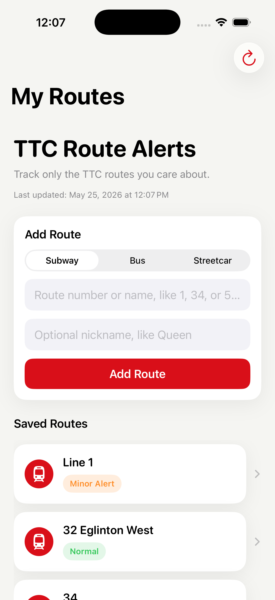
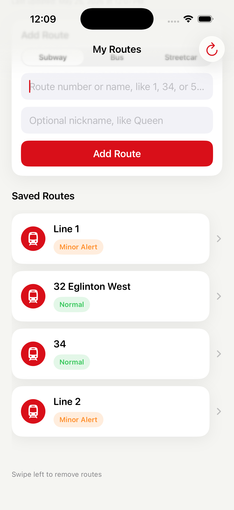
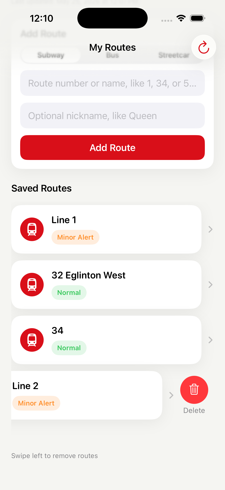
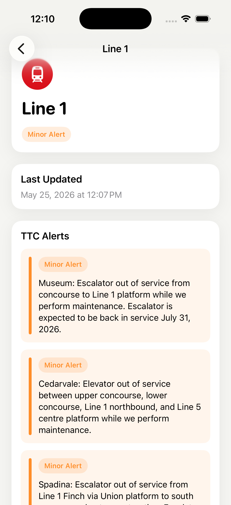

## Why I Built This

TTC provides general service alerts, but commuters usually only care about routes they actually use. TTC Route Alerts focuses on personalized route tracking by allowing users to save routes and quickly see relevant service disruptions.

## Running the App

1. Clone the repository
2. Open the project in Xcode
3. Build and run on an iPhone simulator or device

## Local GTFS Schedule Setup

The app can show scheduled arrivals for nearby stops using TTC GTFS static data. The repository keeps the smaller bundled GTFS files, such as `routes.txt` and `stops.txt`, but does not track `stop_times.txt` because the full file is too large for normal GitHub commits.

To test scheduled arrivals locally:

1. Download the latest TTC GTFS static zip from the TTC open data site.
2. Extract `stop_times.txt` from the zip.
3. Add `stop_times.txt` locally at:

   `ttc-route-alerts/ttc-route-alerts/stop_times.txt`

4. In Xcode, make sure `stop_times.txt` is included in the `ttc-route-alerts` app target so it is copied into the app bundle.

The schedule detail screen also uses `trips.txt` and the existing bundled `routes.txt`. If `trips.txt` is not already present in your local project, extract it from the same TTC GTFS zip and add it to the same app target.

If `stop_times.txt` was already added to Git tracking, remove it from the Git index while keeping the local file:

```bash
git rm --cached ttc-route-alerts/ttc-route-alerts/stop_times.txt
```

Future optimization: generate a smaller bundled schedule subset, or build a local database from GTFS files, instead of committing the full `stop_times.txt`.

## App Icon Setup

The project includes a temporary TTC-inspired app icon in:

`ttc-route-alerts/Assets.xcassets/AppIcon.appiconset/AppIcon-1024.png`

The current Xcode asset catalog uses the newer iOS universal app icon format. Replace the placeholder with a production 1024x1024 PNG and keep it assigned in `AppIcon.appiconset/Contents.json` for the Any, Dark, and Tinted appearances. The image should be square, opaque, and should not include the official TTC logo or any other copyrighted transit mark.

For older or manually expanded icon catalogs, iOS app icons are commonly needed at these point sizes and scales:

- iPhone notification/settings/spotlight sizes: 20, 29, 40, and 60 pt at @2x/@3x
- iPad notification/settings/spotlight/app sizes: 20, 29, 40, 76, and 83.5 pt at the required iPad scales
- App Store marketing icon: 1024x1024 px

# TTC Route Alerts

TTC Route Alerts is a SwiftUI app for saving your regular TTC routes and checking live service alerts that may affect them. It stores your saved routes locally, fetches current TTC alert data, and shows route status updates in a simple, easy-to-read interface.

## Features

- Save TTC routes for quick access
- Select route types: Subway, Bus, or Streetcar
- Add optional nicknames for saved routes
- Use route suggestions and autocomplete
- Load route suggestions from the bundled TTC GTFS static `routes.txt` file
- Edit saved routes without deleting and re-adding them
- Store saved routes locally with UserDefaults
- Fetch live TTC alerts
- Decode GTFS-Realtime alert data
- Match alerts to saved routes with GTFS `route_id` support and text fallback
- Show dynamic route status updates
- Display alert severity indicators
- Find nearby TTC stops using the user's current location
- Show nearby TTC stops with distance from the user
- Show live TTC arrival predictions using TTC BusTime/NVAS data
- Show saved route next-arrival previews on saved bus and streetcar route cards
- Show a saved route detail arrival section with the stop used for the prediction
- Use scheduled GTFS fallback arrivals when live predictions are unavailable
- Manually refresh alert data
- Pull down to refresh alerts
- Automatically refresh alerts while the app is open
- Use iOS BackgroundTasks for best-effort background TTC alert refresh
- Cache the last successful alerts for offline or network failure cases
- Cache arrival preview lookups to keep saved route arrival checks fast
- Request location permission before showing nearby stops and nearby arrivals
- Request local notification permission from Settings
- Send local route alert notifications after manual refresh or pull-to-refresh
- Send background local notifications for saved routes with alerts when background refresh runs
- Show relative last updated timestamps
- View route detail screens
- Use a settings screen for notifications and refresh preferences
- Save a notification preference
- Save a refresh preference setting
- Handle empty, loading, and error states

## Privacy / Data

- Saved routes are stored locally on the user's device.
- Location is used to find nearby TTC stops and nearby arrival predictions.
- Location is not used for accounts, advertising, or tracking.
- TTC alert and arrival data comes from public TTC feeds, including GTFS-Realtime alerts, GTFS static schedule data, and TTC BusTime/NVAS arrival data.
- Notifications are local app notifications generated by the app.
- No user account is required.

## Release Notes / App Store Prep

- The app has been tested on a real iPhone.
- TestFlight testing is recommended before a public App Store release.
- App icon and App Store screenshots still need final polish before submission.

## Tests

- Unit tests for route alert matching with `RouteMatcher`
- Unit tests for alert severity classification with `AlertSeverity`
- Unit tests for route input validation, normalization, suggestion matching, and duplicate detection

## Tech Stack

- Swift
- SwiftUI
- UserDefaults
- UserNotifications
- URLSession
- BackgroundTasks
- SwiftProtobuf
- TTC GTFS-Realtime API
- TTC GTFS static route data

## Important Notes

- iOS controls the exact timing of background refresh.
- The 5 minute and 15 minute refresh preferences are earliest refresh hints only.
- Background refresh is best-effort and depends on iOS scheduling, battery, network availability, and usage patterns.
- Remote push notifications are not implemented.

## Current Screenshots









## Future Improvements

- Smarter notification deduplication across launches
- More advanced background scheduling
- Remote push notifications
- Better offline persistence and alert history
